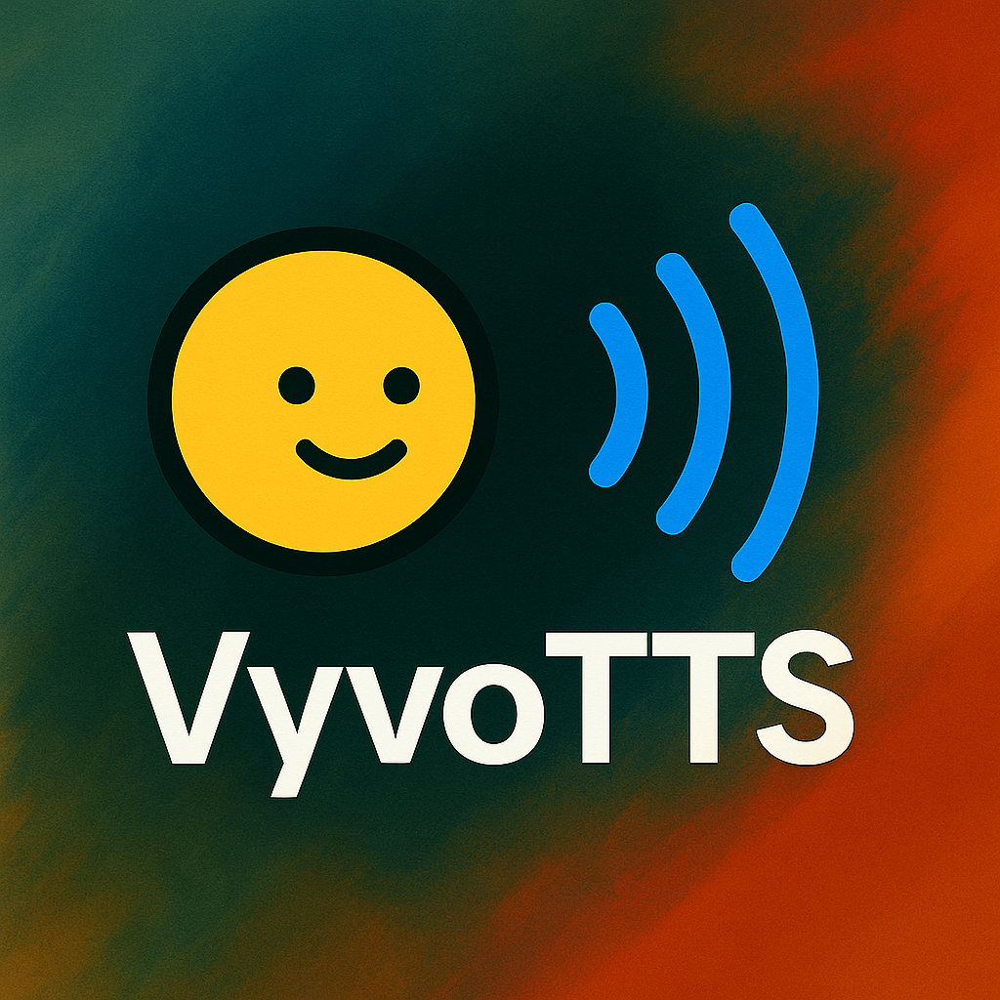

<div align="center">
<h2>
    VyvoTTS: Advanced Text-to-Speech Training Framework 🚀
</h2>
<div>
    
</div>

<div>
    <a href="https://github.com/Vyvo-Labs/VyvoTTS" target="_blank">
        
    </a>
    <a href="https://github.com/Vyvo-Labs/VyvoTTS/blob/main/LICENSE" target="_blank">
        
    </a>
    <a href="https://python.org" target="_blank">
        
    </a>
</div>
</div>

This library was developed by the VyvoTTS team. A Text-to-Speech (TTS) training and inference framework built on top of the LFM2 model.

## Features

- **Pre-training**: Train LFM2 models from scratch with custom datasets
- **Fine-tuning**: Adapt pre-trained models for specific TTS tasks
- **LoRA Adaptation**: Memory-efficient fine-tuning using Low-Rank Adaptation
- **Voice Cloning**: Clone voices using advanced neural techniques
- **Multi-GPU Support**: Distributed training with accelerate

## Installation

```bash
uv venv --python 3.10
uv pip install -r requirements.txt
```

## Quick Start

### Training

#### Fine-tuning
**GPU Requirements:** 30GB VRAM minimum required for fine-tuning

Configure your fine-tuning parameters in `vyvotts/configs/lfm2_ft.yaml` and run:

```bash
accelerate launch --config_file vyvotts/configs/accelerate_finetune.yaml vyvotts/train.py
```

**For lower-end GPUs (6GB+):** Use the Unsloth FP8/FP4 training notebook:
```bash
uv pip install jupyter notebook
uv jupyter notebook notebook/vyvotts-lfm2-train.ipynb
```

#### Pre-training
Configure your pre-training parameters in `vyvotts/configs/lfm2_config.yaml` and run:

```bash
accelerate launch --config_file vyvotts/configs/accelerate_pretrain.yaml vyvotts/train.py
```

### Inference

```python

```

## Roadmap

- [ ] vLLM support
- [ ] Transformers.js support
- [ ] Pretrained model release
- [X] Training and inference code release

## Acknowledgements

We would like to thank the following projects and teams that made this work possible:

- [Orpheus TTS](https://github.com/canopyai/orpheus-tts) - For foundational TTS research and implementation
- [LiquidAI](https://huggingface.co/LiquidAI) - For the LFM2 model architecture and pre-trained weights

## License

This project is licensed under the MIT License - see the [LICENSE](LICENSE) file for details.
